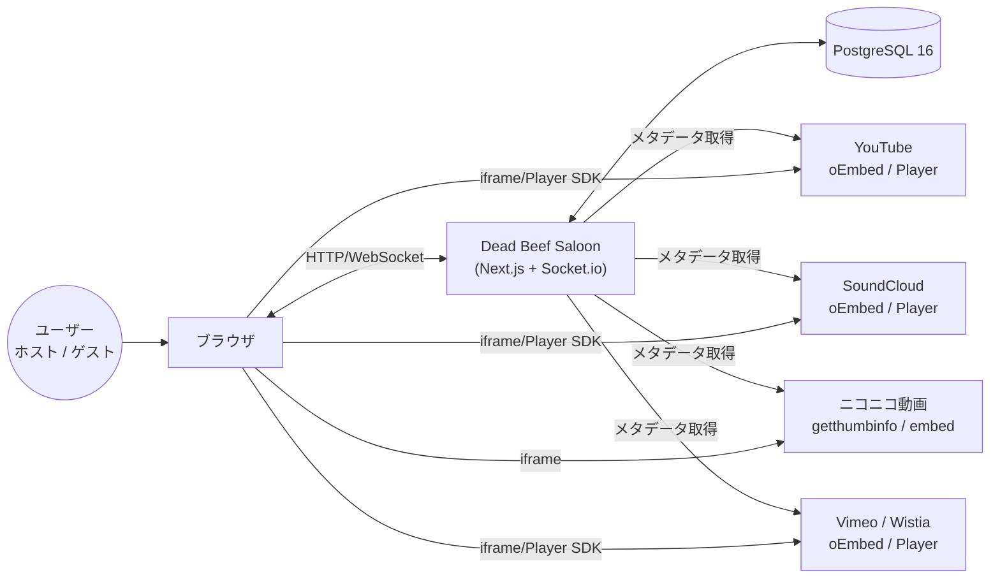
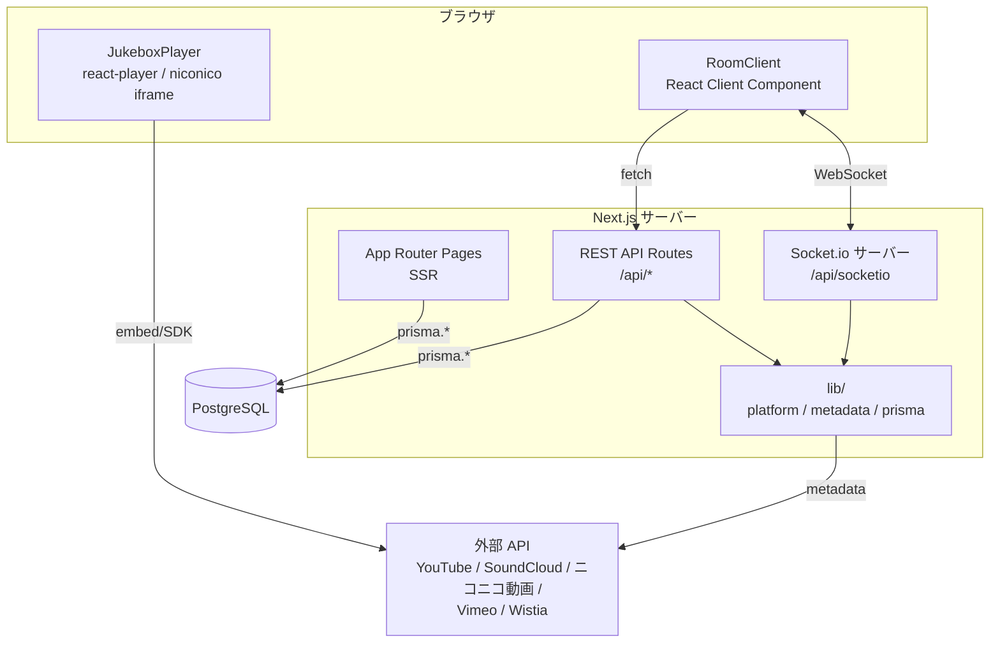
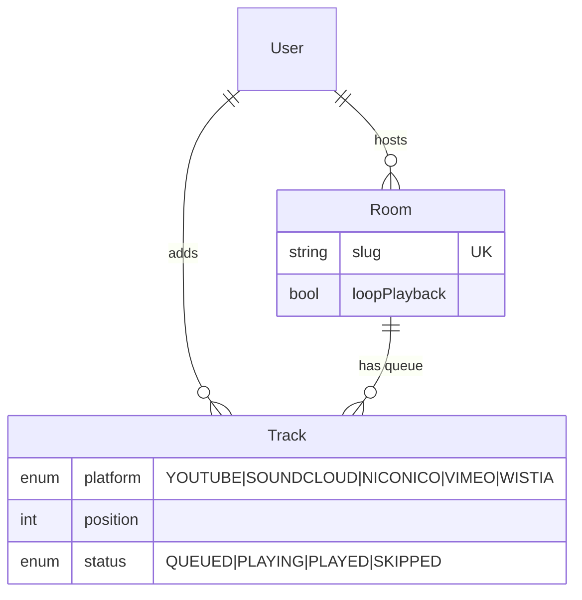
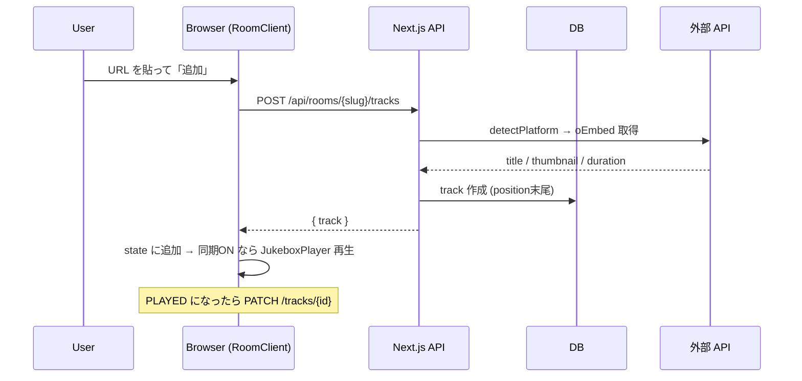
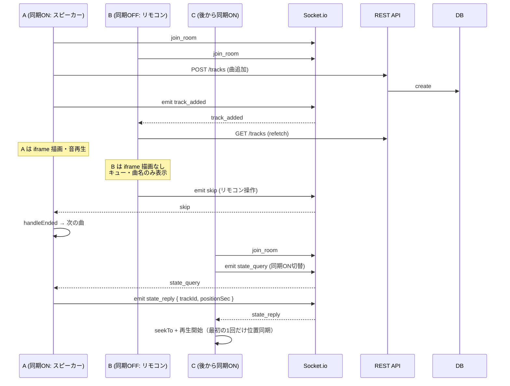
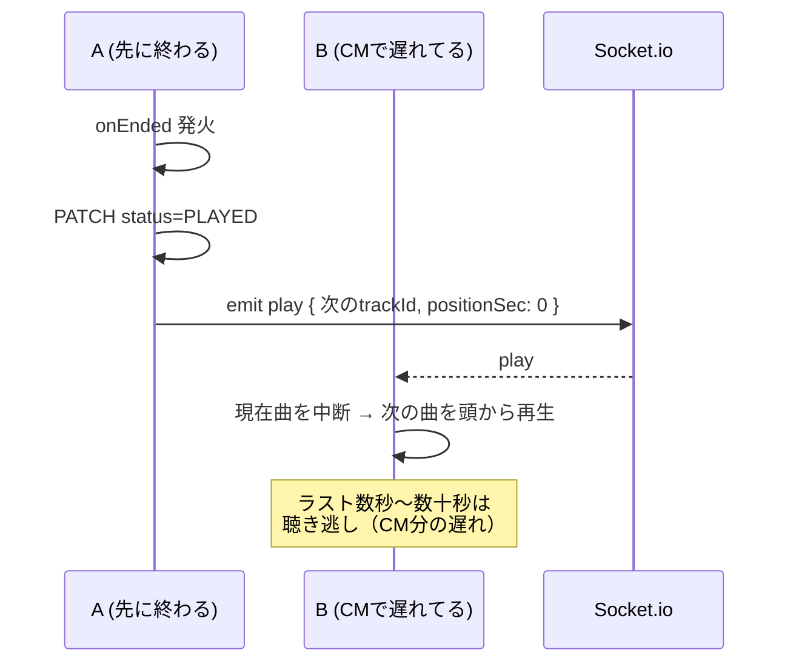
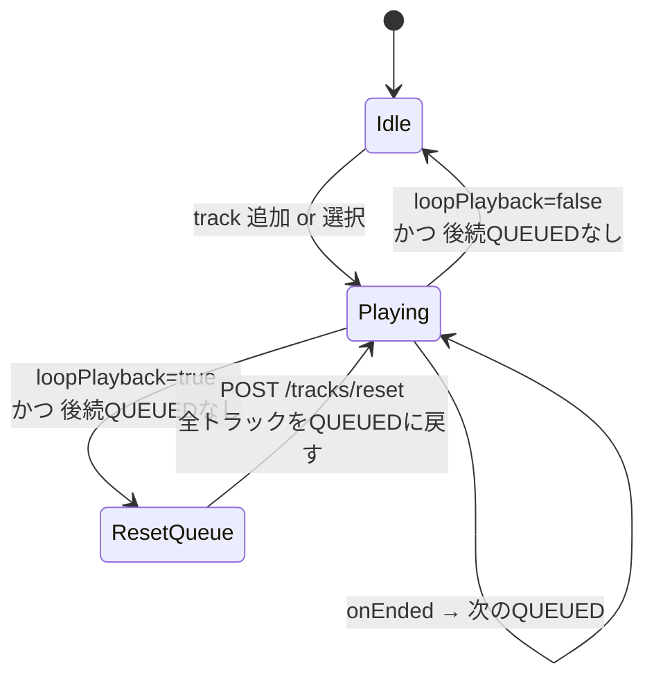

# Architecture

> Dead Beef Saloon（`0xDEADBEEF`）の全体像。システム境界・主要コンポーネント・ユースケースの流れを把握するためのドキュメント。
> 個別の実装詳細は [backend.md](./backend.md) / [frontend.md](./frontend.md) / [infrastructure.md](./infrastructure.md) を参照。

## 1. System Context（C4 Level 1）

- **ユーザー**: ルームを作成する人（ホスト）と URL で参加する人（ゲスト）の 2 ロール（現状は認証なし、`localStorage` にランダムな `guest-xxxx` を保存）
- **外部サービス**: 各プラットフォームの oEmbed / thumbinfo API からメタデータを取得。実際のストリーミングはブラウザで直接行う（サーバーは中継しない）

## 2. Container（C4 Level 2）

- **Pages（SSR）**: トップ (`/`) とルーム (`/room/[slug]`) の初期HTMLをサーバー側で生成
- **REST API**: ルーム・トラックの CRUD、メタデータ取得。状態を変更する操作の正本はここ
- **Socket.io**: 全ルーム共通で利用。イベントはブロードキャスト専用で、**DBの正本は REST API が握る**（Socketは"変更を通知するだけ"で、受け取った側は DB から refetch する）
- **`lib/`**: URL 判定・oEmbed 呼び出し・Prisma クライアント等の共通ロジック

## 3. データモデル概要

詳細は [backend.md](./backend.md#prisma-スキーマ) と `prisma/schema.prisma`。主要な関係：

- `Room.slug` がパス・共有URLのキー（例: `/room/abc12xyz`）
- `Track.position` でキュー順を管理（挿入時に後続を `+1` シフト）
- `Track.status` で再生済みを区別し、ループ時は `PLAYED/SKIPPED` → `QUEUED` に一括戻し

## 4. 主要ユースケースのシーケンス

### 4.1 URLを追加して再生

### 4.2 複数人で曲を追加・再生（同期 ON / OFF 混在）

### 4.3 曲終端時の同期（2 曲目以降）

### 4.4 ループ再生

キュー全消化後に `PLAYED/SKIPPED` なトラックを全て `QUEUED` に戻して先頭から再開する。新規追加は「今かかっている曲の直後」に挿入されるので、割り込みと循環が共存できる。

## 5. モードとスイッチ

ルーム単位の設定はループのみ。それ以外の「同期再生」は per-user / per-device の localStorage 切替。

| 設定 | 永続化先 | 値 | 説明 |
|---|---|---|---|
| `Room.loopPlayback` | DB（ルーム単位） | `true` | キュー全消化後、全 `PLAYED/SKIPPED` を `QUEUED` に戻して繰り返し |
| | | `false` | キュー消化で停止 |
| `listening` | `localStorage:jukebox:listening:<slug>`（端末＋ルーム単位） | `true` | この端末で iframe を mount し、音を鳴らす（"スピーカー"） |
| | | `false` | iframe を mount しない。キュー・曲名・コントロールバーのみ表示する"リモコン" |

### 同期の挙動メモ

- 位置の永続的な同期はしない（CM・バッファリング等で破綻するため）
- **新規 listener が同期ON にした瞬間だけ** `state_query` をブロードキャストして、最初に返ってきた peer の位置に `seekTo` する（race-based）
- 2 曲目以降は `handleEnded` が `play` を emit するので、**先頭だけ全員揃う**（曲尻はずれる前提）

## 6. 開発フェーズ

| Phase | 内容 | 状態 |
|---|---|---|
| 1 | 基盤（URL追加、順次再生） | 実装済 |
| 2 | リアルタイム共有（Socket.io、キュー同期） | 実装済 |
| 3 | per-user 同期トグル（リモコン / スピーカーの分離・初回位置同期） | 実装済 |
| 4 | 認証・投票・チャット・Capacitor によるアプリ化 | 未着手 |

現時点の制約：

- 認証なし。`Room.hostId` はスキーマにはあるが未活用（将来のため枠だけ用意）
- `participantsByRoom` は**プロセス内Map**で管理（複数インスタンス化する場合は Redis 等への外出しが必要）
- ニコニコ動画の `jsapi=1` は HTTPS オリジンでのみ動作するため、ローカル HTTP では正常動作しないことがある（[frontend.md](./frontend.md#ニコニコ動画プレイヤーの特殊事情) 参照）
