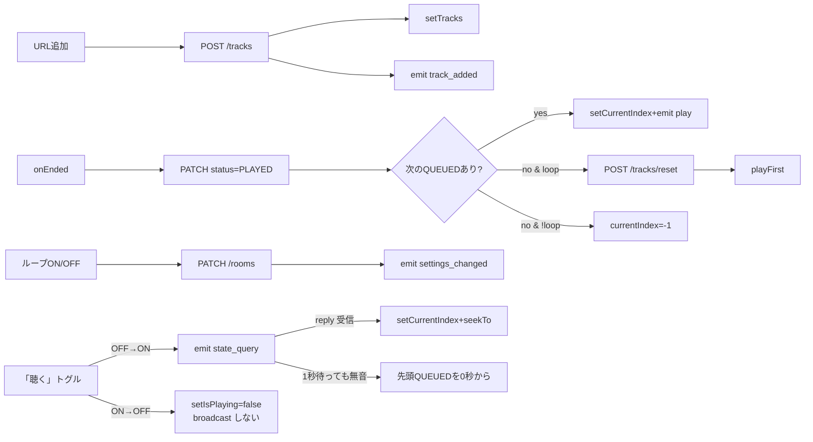
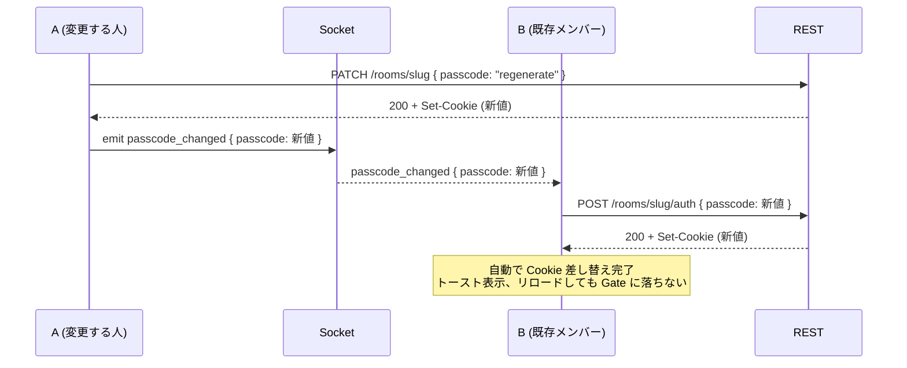

# Frontend

> App Router ページ・主要コンポーネント・状態管理・プラットフォーム固有の実装メモ。
> 全体像は [architecture.md](./architecture.md)、API仕様は [backend.md](./backend.md) を参照。

## 1. ページ構成（App Router）

`src/app/` 配下。`dynamic = "force-dynamic"` で SSR キャッシュ無効化している。

| パス | ファイル | 役割 |
|---|---|---|
| `/` | `src/app/page.tsx` | トップ。ルーム作成フォーム / 参加フォーム / 最近のルーム一覧 |
| `/room/[slug]` | `src/app/room/[slug]/page.tsx` | ルーム画面。DB からルーム+トラックを取得し `RoomClient` に渡す |

レイアウト：

| ファイル | 役割 |
|---|---|
| `src/app/layout.tsx` | ルート `<html lang="ja">`、OGP メタデータ、背景グラデーション |
| `src/app/globals.css` | Tailwind ベース + テーマ変数（`bg-card`, `text-primary` 等） |

## 2. コンポーネント構成

```
src/components/
├── ui/                            再利用可能な汎用UI（tailwind + clsx）
│   ├── Button.tsx
│   ├── Card.tsx
│   ├── Input.tsx
│   ├── Switch.tsx                 アクセシブルなトグル（role=switch）
│   └── Toast.tsx                  トースト通知（Toaster + useToaster フック）
├── home/                          ホームページ専用
│   ├── CreateRoomForm.tsx         ルーム作成（ルーム名 + パスコード付きスライドトグル）
│   └── JoinRoomForm.tsx           コード/URL → /room/[slug] へ遷移
└── room/                          ルームページ専用
    ├── RoomClient.tsx             ⭐ ルーム画面の中核
    ├── JukeboxPlayer.tsx          プレイヤー（react-player + niconico独自、listening=false で iframe 非描画）
    ├── QueueList.tsx              キュー表示・選択・削除
    ├── AddTrackForm.tsx           URL 入力フォーム
    ├── ParticipantList.tsx        参加者表示
    ├── ShareDialog.tsx            共有モーダル（URLコピー / QRコード / OS共有シート呼び出し）
    ├── PasscodeGate.tsx           鍵付きルーム未認証時の入力画面（SSR で passcode Cookie 不一致時に表示）
    └── PasscodeDialog.tsx         ルーム内からのパスコード追加/再生成/削除モーダル
```

## 3. `RoomClient` の状態管理

`src/components/room/RoomClient.tsx` がルーム画面のロジックを全て持つ（~440行）。状態はコンポーネントローカル (`useState`) のみ。Redux 等は導入していない。

### 主要な state

| state | 型 | 役割 |
|---|---|---|
| `room` | `Room` | ルーム設定（`loopPlayback` / `shufflePlayback` 等の更新がここに集約） |
| `tracks` | `Track[]` | キュー。position 昇順で保持 |
| `currentIndex` | `number` | 現在再生中のインデックス（`-1` はアイドル状態） |
| `isPlaying` | `boolean` | 再生中フラグ。listening=false の端末では iframe が無いので "ルームの状態を反映するだけ" |
| `participants` | `Participant[]` | 参加者一覧（Socket は常時接続） |
| `connected` | `boolean` | Socket接続状態 |
| `listening` | `boolean` | **per-user / per-device の「聴く」トグル**。`localStorage:jukebox:listening:<slug>` で永続化、デフォルト OFF |
| `userName` | `string` | `localStorage` に保存される `guest-xxxx` |

### `listening` の意味

`listening` は「この端末で実際に映像／音声を再生するかどうか」を表す **端末ローカル設定**で、DB にも Socket にも載らない。

- `listening=true` ＝ "スピーカー": iframe を mount して鳴らす
- `listening=false` ＝ "リモコン": iframe は mount しない、ヘッダーやコントロールバーは表示され、再生・スキップ・キュー操作は他の listener にブロードキャストされる

各操作者がそれぞれ `localStorage` で独立に切り替えるので、A の「聴く」トグルは B の状態に影響しない。

### 最新 state を effect から参照する `latestRef`

再レンダリングのたびに Socket リスナーを再登録するのを避けるため、`latestRef.current = { tracks, currentIndex, loopPlayback, shufflePlayback, isPlaying, listening }` を毎レンダで更新。Socket ハンドラ内では `latestRef.current` を見ることで最新値を参照する。

同様に `handleEndedRef` で最新の `handleEnded` を保持している（循環依存を避けつつ常に新しい関数を呼ぶため）。`pendingStateQueryRef` は「『聴く』を OFF→ON にした直後の `state_reply` 待ち中か」を保持し、最初の reply を採用したら即クリアする。

### イベントと状態遷移



### Socket リスナーの責務

Socket は全ルームで常時接続。

- `participants` → state 更新
- `track_added` / `queue_changed` → `refreshTracks()` で DB から refetch（クリック「ジャンプ」による status 一括書き換えもこの経路で他端末に反映される）
- `play` → `currentIndex` と `isPlaying` を更新（listening=false でも UI を反映するため受け取る）
- `pause` → `isPlaying=false`
- `skip` → `handleEnded()` を呼び出し（誰が押しても全員進む）
- `settings_changed` → `room.loopPlayback` / `room.shufflePlayback` を受け取った分だけ更新（独立フラグなので boolean プロパティが省略されたものは触らない）
- `passcode_changed` → 他の参加者がパスコードを追加/再生成/削除した通知。**自動追従**（案A）のため、受信側は自分の Cookie を更新する (`POST /api/rooms/[slug]/auth` で新パスコードをセット、または `DELETE` で削除) → `passcode` state を差し替え → トースト表示。これにより既存メンバーは締め出されずに継続操作できる
- `state_query` → 自分が `listening=true` && `isPlaying=true` で曲があるとき、`playerRef.current.getCurrentTime()` を `state_reply` で返す
- `state_reply` → `pendingStateQueryRef.current` が立っているときだけ採用、`setCurrentIndex` + 500ms 後に `seekTo`（iframe mount 待ち）。**最初の 1 件で `pendingStateQueryRef` をクリア**して以降は無視（race-based）

### handleEnded で `play` を emit する理由

各端末は独立に再生していくため、CM やバッファリングで進度がズレる。これを毎曲の頭でリセットするため、`handleEnded` は次曲の `play { trackId, positionSec: 0 }` を emit する。

副作用：CM 等で遅れている端末はその曲のラスト数秒〜数十秒を聴き逃す。これは仕様として許容（位置同期で飛び飛びになるよりマシ）。

### シャッフル再生の分岐ルール

`Room.shufflePlayback` が `true` のときだけ、次曲決定が「`currentIndex` 以降の最初の `QUEUED`」から「`QUEUED` 集合からランダム1つ」（`pickRandomQueued`）に差し替わる。実装は `src/lib/queue.ts` と `RoomClient` 側の数か所だけ。

- `handleEnded`: PLAYED 化後の `updatedTracks` に対して `pickRandomQueued`。ループON 全消化時の `/tracks/reset` 後は `pickRandomQueued(reset, { excludeId: finishedTrack.id })` で「直前まで流れていた曲」を候補から外す（候補0件なら除外を無視するセーフティあり）。
- `handleAdded`: アイドル復帰時 (`currentIndex < 0`) の自動再生で、追加曲を含む QUEUED 集合からランダム選曲。シャッフルOFF 時は従来どおり `pickIndexAfterAdd`（QUEUED があればそれ、なければ追加した末尾）。
- `handleSelect`: クリックした曲だけ即再生し、他の status は触らない（`/tracks/[id]/select` API は呼ばない）。順番再生の前提が無いので「前は PLAYED・以降は QUEUED」リセットを skip する。
- `hasNext`: `tracks.some(t => t.status === "QUEUED" || t.status === "PLAYING") || (loopPlayback && tracks.length > 0)` で判定。
- `handleToggleLoop` の reset 後の最初の選曲も、シャッフルON ならランダム。

シャッフルOFF/ON 切替自体は副作用なし（次の `handleEnded` から効くだけ）で、`handleToggleShuffle` は PATCH 失敗時にロールバックする以外は単純なトグル。

### 楽観的更新 + 再取得

曲追加時は：

1. ローカル state に楽観的に末尾追加（ループ ON / OFF 問わず常に末尾。割り込みは無し）
2. 現在キューがアイドル（`currentIndex < 0`）なら、追加した曲を即再生開始する（`emit("play")`）
3. `emit("track_added")` で他クライアントに通知
4. `refreshTracks()` で DB の正本を再取得し、全員の position を完全一致させる

この「楽観更新→再取得」パターンで、UI 応答性と整合性を両立している。

### キュー上の曲をクリックしたとき

`QueueList` 上の曲をクリックすると `handleSelect(idx)` が走る。シャッフルOFF 時の挙動：

1. 楽観的に `tracks` の `status` を書き換える（`idx` 未満で `QUEUED` だったものを `PLAYED` に、`idx` 以降の `PLAYED/SKIPPED` を `QUEUED` に）
2. `currentIndex = idx` / `isPlaying = true`
3. `emit("play", { trackId, positionSec: 0 })` で他端末の再生も同期
4. `POST /tracks/[trackId]/select` を叩いて DB 上の正本を一括書き換え。成功したら `emit("queue_changed")` で他端末に refetch を促す

これにより、クリック以前は再生済みとして淡色表示され、以降は未再生として並ぶ「再生履歴の整合」が取れる。

シャッフルON 時は順番再生の前提が無いため、上記 1 と 4 を skip する（`/select` API は呼ばず、他のトラック status にも触らない）。`currentIndex = idx` と `emit("play")` だけが走り、次曲は `handleEnded` から `pickRandomQueued` で改めてランダム選曲される。

## 4. `JukeboxPlayer` の再生制御

`src/components/room/JukeboxPlayer.tsx`。`react-player` をラップし、ニコニコ動画だけ独自実装。

### `listening` prop による条件描画

`listening=false` のとき：

- 動画 iframe（ReactPlayer / NiconicoPlayer）は **mount しない**（ロードもしない、音も出ない）
- 音量・ミュートのコントロールも非表示（音が出ない端末で出しても意味ないため）
- 再生 / 一時停止 / スキップボタン・曲名・サムネは従来通り表示（リモコンとして使うため）
- 再生ボタンは `usesCustomPlayer`（NicoNico）でも有効（iframe が無いので "プレイヤー内で操作" 制約も無効化）

### プラットフォーム分岐（listening=true の場合）

```tsx
isNico
  ? <NiconicoPlayer ... />
  : <ReactPlayer url={track.url} playing={playing} controls ... />
```

`react-player/lazy` を `next/dynamic` で `ssr: false` 読み込み（YouTube / SoundCloud / Vimeo / Wistia のプラットフォームSDKをブラウザで URL に応じて動的ロードするため）。`track.url` を渡すだけで `react-player` が URL パターンから対応プラグインを選ぶので、これらのプラットフォームでは追加の分岐は不要。

### ニコニコ動画が独自実装な理由

`react-player` v2 はニコニコ動画に対応していないため、独自 iframe 実装で補っている。`embed.nicovideo.jp/watch/<id>?jsapi=1` を iframe で埋め込み、`postMessage` で `playerStatusChange` / `ended` を監視。保険として `durationSec + 3秒` の `setTimeout` で自動送りする。

### コントロールの制約

`listening=true` でかつ `usesCustomPlayer` が `true`（＝ ニコニコ動画再生中）のときは以下が無効化される：

- 外部の再生/一時停止ボタン → プレイヤー内のコントロール（iframe 内のボタン）で操作
- ミュート / 音量スライダー → プレイヤー内で調整
- `seekTo` 経由の位置合わせも効かない（`state_reply` を受けて `seekTo` してもニコニコ動画には届かない）

これはニコニコ動画の埋め込みでは postMessage で volume/seek を送る手段が無いためで、ユーザーは iframe 内のネイティブコントロールを使う想定。

### `JukeboxPlayerHandle` の露出

`forwardRef + useImperativeHandle` で親に以下を公開：

| メソッド | 用途 |
|---|---|
| `seekTo(seconds)` | `state_reply` 受信時に位置を合わせる |
| `getCurrentTime()` | 他の peer から `state_query` が来たときに、現在位置を返すため。内部で react-player の `getCurrentTime()` を呼び、取得できなかった場合は `onProgress` で蓄積した `lastKnownPositionRef` を返す |

### マスター音量

プレイヤー下部のコントロールバーに音量スライダー（0〜100）とミュートボタンを持つ。`JukeboxPlayer` 内の `useState` でローカル管理し、`localStorage` に永続化する。

| キー | 値 |
|---|---|
| `xw1.player.volume` | `0.0`〜`1.0` の文字列 |
| `xw1.player.muted` | `"1"` または `"0"` |

`ReactPlayer` には `volume` / `muted` prop を渡すため、YouTube / SoundCloud / Vimeo / Wistia に効く。曲が切り替わっても維持されるので「次の曲が突然爆音」を防ぐのが主目的。

**ニコニコ動画は例外**: 埋め込みの `postMessage` API に音量コマンドが無いため、スライダーとミュートは `disabled` にし、`title` 属性で「プレイヤー内で調整してください」と案内する。

### ニコニコ動画プレイヤーの特殊事情

ニコニコ動画の埋め込みは `https://embed.nicovideo.jp/watch/{id}?jsapi=1&playerId={id}&autoplay=1` を iframe で読み込む。`jsapi=1` でイベントAPIが有効化され、`postMessage` で双方向通信できる。

観測されたプロトコル（実装時に実測）：

| eventName | 意味 |
|---|---|
| `loadComplete` | iframe が準備完了（1回のみ） |
| `playerStatusChange` | `data.playerStatus`: `1`=再生前, `2`=再生中, `3`=一時停止, `4`=終了 |
| `ended` / `playerEnd` | 再生終了（互換用） |
| `playerMetadataChange` | 再生中に頻発（使用しない） |

#### 実装上の罠と対策

1. **`playerMetadataChange` に反応すると位置リセット** → `playerMetadataChange` は無視し、`playerStatusChange` と `ended`/`playerEnd` のみ扱う
2. **`play` を多重送信するとポジション0に戻る** → `playSentRef` で `loadComplete` 受信時に1回だけ `play` を送る
3. **"ended" が飛ばないことがある**（ミュートタブのスロットリング等） → `track.durationSec + 3秒` の `setTimeout` で保険の自動遷移
4. **`jsapi=1` は HTTPS オリジン必須** → `http://localhost` だと `/play` エンドポイントが 403 を返し、「プレーヤーを更新…」オーバーレイが出る。本番は HTTPS で運用すること

## 5. パスコードゲート / 管理モーダル

### `PasscodeGate`

`src/components/room/PasscodeGate.tsx`。鍵付きルームで `passcode` Cookie が不一致または未設定のとき、`/room/[slug]/page.tsx` の SSR がこのコンポーネントだけを返す（`RoomClient` は mount されない＝そもそも iframe や Socket に繋がない）。

- 6桁の英数字（大文字）を入力 → `POST /api/rooms/[slug]/auth` で検証 → 成功すると Set-Cookie が返るので `router.refresh()` で SSR を再実行、以降は通常の `RoomClient` が描画される
- 不正解は `401`、赤字メッセージで通知

### `PasscodeDialog`

`src/components/room/PasscodeDialog.tsx`。ルーム内ヘッダーの鍵ボタンから呼ぶ管理モーダル。

| 状態 | 表示 |
|---|---|
| 鍵なし | 「パスコードを設定する」ボタン → `PATCH /api/rooms/[slug] { passcode: "regenerate" }` |
| 鍵あり | 現在のパスコードを大きく表示 + コピーボタン + 「再生成」と「鍵を外す」ボタン |

変更が成功するとレスポンスに新パスコード（または null）が載るので、`onChanged(next)` でルーム側に伝える。ルーム側は state を更新し、`emit("passcode_changed", { passcode: next })` で他の参加者に通知する。

### 自動追従（案A）のフロー



## 6. 共有モーダル (`ShareDialog`)

`src/components/room/ShareDialog.tsx`。ヘッダーの「共有」ボタン (`RoomClient` 内 `handleShare`) が `shareOpen` を `true` にして開く自前モーダル。

`navigator.share` を直接呼んでいた旧実装は OS の共有シートに委ねていたため、**Windows では「リンクをコピー」や QR コードがあるのに macOS では無い**という差が出ていた（Chrome 側の違いではなく OS 共有シートの差）。これをアプリ側で吸収するために、どの OS でも同じ UI を出す。

モーダルの内容：

- QR コード（`qrcode.react` の `QRCodeSVG`、176px、`level="M"`）
- ルーム URL の表示 + 「コピー」ボタン（`navigator.clipboard.writeText` → 1.8 秒だけ「コピー済」に切り替え）
- 「他のアプリで共有」ボタン（`navigator.share` を呼ぶ）。ブラウザが Web Share API 非対応なら **ボタン自体を非表示**（`canNativeShare` を mount 時に判定）

UX 上の挙動：

- 背景クリックと `Esc` キーで閉じる
- モーダルを閉じるたびに `copied` state をリセット
- URL 入力欄は `readOnly` + `onFocus` で全選択（コピーが効かない環境でも手動コピーしやすいように）

## 7. Socket.io クライアント

`src/lib/socket.ts` がシングルトン：

```ts
export function getSocket(): Socket {
  if (!socket) {
    socket = io({
      path: "/api/socketio",
      autoConnect: true,
      transports: ["websocket", "polling"],
    });
  }
  return socket;
}
```

- デフォルトで `window.location.origin` に接続（同一オリジン前提）
- WebSocket を優先、ダメなら polling フォールバック
- `RoomClient` の `useEffect` クリーンアップでリスナー解除はするが、接続自体は維持（タブ内で再利用）

## 8. スタイリング

- **Tailwind CSS** + カスタム CSS 変数（`globals.css` のテーマトークン: `--primary`, `--border`, `--muted-foreground` など）
- ユーティリティ合成は `cn()` (`src/lib/utils.ts` → `clsx` + `tailwind-merge`) を使う
- アイコンは **lucide-react**（`Play`, `Pause`, `SkipForward`, `Disc3`, `Repeat`, `Shuffle`, `Users`, `Wifi`/`WifiOff`, `Share2` 等）
- ダークテーマ前提。`bg-gradient-hero` の背景を `<body>` に敷いている

## 9. 画像ドメインの登録

外部サムネイルを `` で扱う場合、Next.js の `<Image>` を使うなら `next.config.ts` の `images.remotePatterns` に追加が必要。現在の許可リスト：

- `i.ytimg.com` / `img.youtube.com`（YouTube）
- `i1.sndcdn.com`（SoundCloud）
- `nicovideo.cdn.nimg.jp` / `tn.smilevideo.jp`（ニコニコ動画）
- `i.vimeocdn.com`（Vimeo）
- `embed-ssl.wistia.com` / `embed-fastly.wistia.com` / `embedwistia-a.akamaihd.net`（Wistia）
現状 `QueueList` では `` (`no-img-element` の eslint-disable 付き) を使っていて Next.js Image は未使用だが、将来切り替える際はここを更新する。

## 10. ユーザー識別

認証は未実装。`localStorage` の `jukebox:userName` にランダムな `guest-xxxx` を保存し、Socket の `join_room` で渡す。

- ブラウザを変えれば別人扱い
- 消せば別人になる
- **本格運用時は認証（NextAuth等）の導入が必要**（Phase 4）

## 11. 新ページ / 新機能を追加する時のチェックリスト

1. ページ追加なら `src/app/xxx/page.tsx` を作る（SSR 必要なら `dynamic = "force-dynamic"`）
2. API が必要なら [backend.md](./backend.md) のルートにエンドポイント追加、Zodで入力バリデーション
3. ルーム内の状態が増えるなら `RoomClient` の `latestRef` に追加し、Socket リスナーを拡張
4. 新プラットフォーム対応は [backend.md §5 プラットフォーム拡張の手順](./backend.md#プラットフォーム拡張の手順) を参照
5. スキーマが変わるなら `prisma/migrations/` を生成し、[architecture.md](./architecture.md) と [backend.md](./backend.md) の該当セクションを更新
