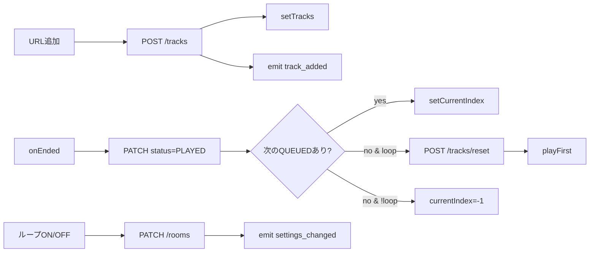

# Frontend

> App Router ページ・主要コンポーネント・状態管理・プラットフォーム固有の実装メモ。
> 全体像は [architecture.md](./architecture.md)、API仕様は [backend.md](./backend.md) を参照。

## 1. ページ構成（App Router）

`src/app/` 配下。`dynamic = "force-dynamic"` で SSR キャッシュ無効化している。

| パス | ファイル | 役割 |
|---|---|---|
| `/` | `src/app/page.tsx` | トップ。ルーム作成フォーム / 参加フォーム / 最近のルーム一覧 |
| `/room/[slug]` | `src/app/room/[slug]/page.tsx` | ルーム画面。DB からルーム+トラックを取得し `RoomClient` に渡す |

レイアウト：

| ファイル | 役割 |
|---|---|
| `src/app/layout.tsx` | ルート `<html lang="ja">`、OGP メタデータ、背景グラデーション |
| `src/app/globals.css` | Tailwind ベース + テーマ変数（`bg-card`, `text-primary` 等） |

## 2. コンポーネント構成

```
src/components/
├── ui/                            再利用可能な汎用UI（tailwind + clsx）
│   ├── Button.tsx
│   ├── Card.tsx
│   └── Input.tsx
├── home/                          ホームページ専用
│   ├── CreateRoomForm.tsx         ルーム作成（mode / playbackMode 選択）
│   └── JoinRoomForm.tsx           コード/URL → /room/[slug] へ遷移
└── room/                          ルームページ専用
    ├── RoomClient.tsx             ⭐ ルーム画面の中核
    ├── JukeboxPlayer.tsx          プレイヤー（react-player + niconico独自）
    ├── QueueList.tsx              キュー表示・選択・削除
    ├── AddTrackForm.tsx           URL 入力フォーム
    └── ParticipantList.tsx        参加者表示（PARTY時のみ）
```

## 3. `RoomClient` の状態管理

`src/components/room/RoomClient.tsx` がルーム画面のロジックを全て持つ（~440行）。状態はコンポーネントローカル (`useState`) のみ。Redux 等は導入していない。

### 主要な state

| state | 型 | 役割 |
|---|---|---|
| `room` | `Room` | ルーム設定（`loopPlayback` 等の更新がここに集約） |
| `tracks` | `Track[]` | キュー。position 昇順で保持 |
| `currentIndex` | `number` | 現在再生中のインデックス（`-1` はアイドル状態） |
| `isPlaying` | `boolean` | 再生中フラグ |
| `participants` | `Participant[]` | PARTY時の参加者一覧 |
| `connected` | `boolean` | Socket接続状態 |
| `userName` | `string` | `localStorage` に保存される `guest-xxxx` |

### 最新 state を effect から参照する `latestRef`

再レンダリングのたびに Socket リスナーを再登録するのを避けるため、`latestRef.current = { tracks, currentIndex, loopPlayback, isPlaying }` を毎レンダで更新。Socket ハンドラ内では `latestRef.current` を見ることで最新値を参照する。

同様に `handleEndedRef` で最新の `handleEnded` を保持している（循環依存を避けつつ常に新しい関数を呼ぶため）。

### イベントと状態遷移



### Socket リスナーの責務（PARTY モード時のみ）

- `participants` → state 更新
- `track_added` / `queue_changed` → `refreshTracks()` で DB から refetch
- `play` → `currentIndex` と `isPlaying` を更新
- `pause` → `isPlaying=false`
- `skip` → `handleEnded()` を呼び出し（ホスト以外でも進ませる）
- `sync_state` → `playbackMode === "SYNC"` のときだけ `playerRef.current.seekTo(positionSec)` で同期
- `settings_changed` → `room.loopPlayback` を更新

**ソロ（SOLO）モードでは Socket に接続しない**。`useEffect` の `if (!isParty) return;` で early return。

### 楽観的更新 + 再取得

曲追加時は：

1. ローカル state に楽観的に挿入（ループ中は `currentIndex + QUEUED連続` の末尾直後に）
2. `emit("track_added")` で他クライアントに通知
3. `refreshTracks()` で DB の正本を再取得し、全員の position を完全一致させる

この「楽観更新→再取得」パターンで、UI 応答性と整合性を両立している。

## 4. `JukeboxPlayer` の再生制御

`src/components/room/JukeboxPlayer.tsx`。`react-player` をラップし、ニコニコ動画だけ独自実装。

### プラットフォーム分岐

```tsx
isNico
  ? <NiconicoPlayer ... />
  : <ReactPlayer url={track.url} playing={playing} controls ... />
```

`react-player/lazy` を `next/dynamic` で `ssr: false` 読み込み（YouTube / SoundCloud / Vimeo / Wistia のプラットフォームSDKをブラウザで URL に応じて動的ロードするため）。`track.url` を渡すだけで `react-player` が URL パターンから対応プラグインを選ぶので、これらのプラットフォームでは追加の分岐は不要。

### ニコニコ動画が独自実装な理由

`react-player` v2 はニコニコ動画に対応していないため、独自 iframe 実装で補っている。`embed.nicovideo.jp/watch/<id>?jsapi=1` を iframe で埋め込み、`postMessage` で `playerStatusChange` / `ended` を監視。保険として `durationSec + 3秒` の `setTimeout` で自動送りする。

### コントロールの制約

`usesCustomPlayer` が `true`（＝ ニコニコ動画再生中）のときは以下が無効化される：

- 外部の再生/一時停止ボタン → プレイヤー内のコントロール（iframe 内のボタン）で操作
- ミュート / 音量スライダー → プレイヤー内で調整
- `sync_state` による `seekTo` も効かない

これはニコニコ動画の埋め込みでは postMessage で volume/seek を送る手段が無いためで、ユーザーは iframe 内のネイティブコントロールを使う想定。

### `seekTo` の露出

`forwardRef + useImperativeHandle` で親に `seekTo(seconds)` メソッドを公開。`RoomClient` が `sync_state` イベントを受けたときに呼ぶ。

### マスター音量

プレイヤー下部のコントロールバーに音量スライダー（0〜100）とミュートボタンを持つ。`JukeboxPlayer` 内の `useState` でローカル管理し、`localStorage` に永続化する。

| キー | 値 |
|---|---|
| `xw1.player.volume` | `0.0`〜`1.0` の文字列 |
| `xw1.player.muted` | `"1"` または `"0"` |

`ReactPlayer` には `volume` / `muted` prop を渡すため、YouTube / SoundCloud / Vimeo / Wistia に効く。曲が切り替わっても維持されるので「次の曲が突然爆音」を防ぐのが主目的。

**ニコニコ動画は例外**: 埋め込みの `postMessage` API に音量コマンドが無いため、スライダーとミュートは `disabled` にし、`title` 属性で「プレイヤー内で調整してください」と案内する。

### ニコニコ動画プレイヤーの特殊事情

ニコニコ動画の埋め込みは `https://embed.nicovideo.jp/watch/{id}?jsapi=1&playerId={id}&autoplay=1` を iframe で読み込む。`jsapi=1` でイベントAPIが有効化され、`postMessage` で双方向通信できる。

観測されたプロトコル（実装時に実測）：

| eventName | 意味 |
|---|---|
| `loadComplete` | iframe が準備完了（1回のみ） |
| `playerStatusChange` | `data.playerStatus`: `1`=再生前, `2`=再生中, `3`=一時停止, `4`=終了 |
| `ended` / `playerEnd` | 再生終了（互換用） |
| `playerMetadataChange` | 再生中に頻発（使用しない） |

#### 実装上の罠と対策

1. **`playerMetadataChange` に反応すると位置リセット** → `playerMetadataChange` は無視し、`playerStatusChange` と `ended`/`playerEnd` のみ扱う
2. **`play` を多重送信するとポジション0に戻る** → `playSentRef` で `loadComplete` 受信時に1回だけ `play` を送る
3. **"ended" が飛ばないことがある**（ミュートタブのスロットリング等） → `track.durationSec + 3秒` の `setTimeout` で保険の自動遷移
4. **`jsapi=1` は HTTPS オリジン必須** → `http://localhost` だと `/play` エンドポイントが 403 を返し、「プレーヤーを更新…」オーバーレイが出る。本番は HTTPS で運用すること

## 5. Socket.io クライアント

`src/lib/socket.ts` がシングルトン：

```ts
export function getSocket(): Socket {
  if (!socket) {
    socket = io({
      path: "/api/socketio",
      autoConnect: true,
      transports: ["websocket", "polling"],
    });
  }
  return socket;
}
```

- デフォルトで `window.location.origin` に接続（同一オリジン前提）
- WebSocket を優先、ダメなら polling フォールバック
- `RoomClient` の `useEffect` クリーンアップでリスナー解除はするが、接続自体は維持（タブ内で再利用）

## 6. スタイリング

- **Tailwind CSS** + カスタム CSS 変数（`globals.css` のテーマトークン: `--primary`, `--border`, `--muted-foreground` など）
- ユーティリティ合成は `cn()` (`src/lib/utils.ts` → `clsx` + `tailwind-merge`) を使う
- アイコンは **lucide-react**（`Play`, `Pause`, `SkipForward`, `Disc3`, `Repeat`, `Users`, `Wifi`/`WifiOff`, `Share2` 等）
- ダークテーマ前提。`bg-gradient-hero` の背景を `<body>` に敷いている

## 7. 画像ドメインの登録

外部サムネイルを `` で扱う場合、Next.js の `<Image>` を使うなら `next.config.ts` の `images.remotePatterns` に追加が必要。現在の許可リスト：

- `i.ytimg.com` / `img.youtube.com`（YouTube）
- `i1.sndcdn.com`（SoundCloud）
- `nicovideo.cdn.nimg.jp` / `tn.smilevideo.jp`（ニコニコ動画）
- `i.vimeocdn.com`（Vimeo）
- `embed-ssl.wistia.com` / `embed-fastly.wistia.com` / `embedwistia-a.akamaihd.net`（Wistia）
現状 `QueueList` では `` (`no-img-element` の eslint-disable 付き) を使っていて Next.js Image は未使用だが、将来切り替える際はここを更新する。

## 8. ユーザー識別

認証は未実装。`localStorage` の `jukebox:userName` にランダムな `guest-xxxx` を保存し、Socket の `join_room` で渡す。

- ブラウザを変えれば別人扱い
- 消せば別人になる
- **本格運用時は認証（NextAuth等）の導入が必要**（Phase 4）

## 9. 新ページ / 新機能を追加する時のチェックリスト

1. ページ追加なら `src/app/xxx/page.tsx` を作る（SSR 必要なら `dynamic = "force-dynamic"`）
2. API が必要なら [backend.md](./backend.md) のルートにエンドポイント追加、Zodで入力バリデーション
3. ルーム内の状態が増えるなら `RoomClient` の `latestRef` に追加し、Socket リスナーを拡張
4. 新プラットフォーム対応は [backend.md §5 プラットフォーム拡張の手順](./backend.md#プラットフォーム拡張の手順) を参照
5. スキーマが変わるなら `prisma/migrations/` を生成し、[architecture.md](./architecture.md) と [backend.md](./backend.md) の該当セクションを更新
